# Data Model: ER Diagram and Data Dictionary

This document describes the backend's Postgres (Supabase) schema: which tables exist, which backend module owns each one, and how they relate. Read it before you write a query or add a migration, so you don't have to rebuild the schema from raw SQL.

The migration files are the source of truth. This page is a map of them and must be kept in step with them (see [Keeping this document current](#keeping-this-document-current)).

Companion docs:

- [BACKEND-MODULE-MAP.md](./BACKEND-MODULE-MAP.md): what each backend module does.
- [ARCHITECTURE.md](./ARCHITECTURE.md): system overview.
- [INVARIANTS.md](./INVARIANTS.md): rules the data and contracts must uphold.

---

## Contents

1. [Where migrations live and why they are split](#where-migrations-live-and-why-they-are-split)
2. [Conventions you need to know first](#conventions-you-need-to-know-first)
3. [ER diagram (core domains)](#er-diagram-core-domains)
4. [Data dictionary](#data-dictionary)
5. [Tables used in code but not defined by any migration](#tables-used-in-code-but-not-defined-by-any-migration)
6. [Known schema hazards](#known-schema-hazards)
7. [Keeping this document current](#keeping-this-document-current)

---

## Where migrations live and why they are split

There are 40 migrations in three folders:

| Folder | Files | How it is applied | Why it is separate |
|---|---|---|---|
| `app/backend/supabase/migrations/` | 38 migrations (plus 1 non-migration `.test.sql` file) | Automatically. CI runs `supabase db push --include-all` through [`.github/actions/run-migrations`](../.github/actions/run-migrations/action.yml). | This is the main timeline. Every migration belongs here unless there is a strong reason otherwise. |
| `app/backend/src/branch-preview/migrations/` | `001_create_branch_preview_table.sql` | **Not applied by CI.** The Supabase CLI only reads `supabase/migrations/`. | Written as a self-contained module migration while the branch-preview feature was a prototype. It has been **superseded** by `supabase/migrations/20260724000000_branch_preview_auto_expiry.sql`, which recreates the same `branch_preview_environments` table (`CREATE TABLE IF NOT EXISTS`) and adds auto-expiry columns. The module-local file is kept only for history. Do not edit it; change the table from the main folder. |
| `app/backend/src/crash-reporting/migrations/` | `001_create_crash_reporting_tables.sql` | **Manually**, with `psql -f` or the Supabase SQL editor, as described in [`src/crash-reporting/DEPLOYMENT_CHECKLIST.md`](../app/backend/src/crash-reporting/DEPLOYMENT_CHECKLIST.md) and [`app/backend/SETUP_GUIDE.md`](../app/backend/SETUP_GUIDE.md). | Crash reports hold user-linked diagnostic data under strict row-level security (RLS) policies. The feature shipped as an opt-in module with its own deployment checklist, so its schema was kept beside the module and applied only where crash reporting is turned on. |

What this means for you:

- **New migrations go in `app/backend/supabase/migrations/`.** Do not create new module-local `migrations/` folders; CI will never run them.
- An environment built only from `supabase db push` **will not have** `crash_reports` or `crash_reporting_settings`. The crash-reporting endpoints will fail there until that SQL is applied by hand.
- Moving the crash-reporting SQL into the main timeline is open follow-up work. Until that happens, the manual step stays documented in the crash-reporting checklist.

---

## Conventions you need to know first

1. **Users are Stellar public keys, not rows.** There is no `users` table. A user is identified by a Stellar `G…` public key stored as `text`. Columns named `public_key`, `owner_public_key`, `seller_public_key`, `bidder_public_key`, `owner_id` (api-keys) and `user_id` (crash-reporting) all hold that identifier. **None of them has a foreign key.** Joins across domains on the public key are *logical* joins, made in application code.
2. **Few real foreign keys.** Real FKs exist only inside a domain (parent/child or audit tables). Links between domains, such as a payment link to its on-chain transaction, match on text values like `tx_hash` or `username` with no constraint. The diagram shows these as dashed lines.
3. **Primary keys** are `uuid` with `DEFAULT gen_random_uuid()`, except `feature_flags.key` (text), `cursors.id` (text), `indexer_checkpoints.contract_id` (text), `unparsed_soroban_events.paging_token` (text) and `crash_reporting_settings.user_id` (text).
4. **Preview scoping.** Since `20260630000001_add_preview_scope_support.sql`, several tables carry a nullable `preview_scope text` column. It holds a `preview_scopes.scope_id` value (sent in the `X-Preview-Scope` header), but it is **not** a foreign key. The preview-scope module filters on it in code, and the `delete_expired_preview_scope_data()` function deletes those rows when a scope expires. Tables that have it: `payment_links`, `recurring_payment_links`, `recurring_payment_executions`, `notification_log`, `transaction_receipts`, `unmatched_transactions` and `in_app_notifications`.
5. **Amounts** are stored inconsistently. `payment_links.amount` and the event tables use decimal strings (`text`), recurring links use `DECIMAL(17,7)`, the marketplace uses `NUMERIC(20,7)`, and notification thresholds use `BIGINT` stroops. Check the column type before you compare or sum amounts.

---

## ER diagram (core domains)

The diagram shows each table's primary key, its foreign keys and the columns used for joins. The full column lists are in the [data dictionary](#data-dictionary).

- **Solid line**: a real `REFERENCES` foreign key.
- **Dashed line**: a logical join with no database constraint.

```mermaid
erDiagram
    %% ---------- usernames & marketplace ----------
    usernames {
        uuid id PK
        text username UK "lowercase, FK target"
        text public_key "Stellar G... key (no FK)"
    }
    username_marketplace {
        uuid id PK
        text username FK
        text seller_public_key
        text buyer_public_key
        text status "active/sold/cancelled"
    }
    username_bids {
        uuid id PK
        uuid listing_id FK
        text bidder_public_key
        text status "pending/accepted/rejected/cancelled"
    }
    usernames ||--o{ username_marketplace : "listed as (ON DELETE CASCADE)"
    username_marketplace ||--o{ username_bids : "receives (ON DELETE CASCADE)"

    %% ---------- links / payments ----------
    payment_links {
        uuid id PK
        text owner_public_key
        text destination_public_key
        text reference_id UK
        text status "open/paid/expired/cancelled"
        text matched_tx_hash
        text preview_scope
    }
    payment_link_expiry_audit {
        uuid id PK
        uuid link_id FK
        text previous_status
        text new_status
    }
    recurring_payment_links {
        uuid id PK
        text username "optional, no FK"
        text destination
        text status "active/paused/completed/cancelled"
        text preview_scope
    }
    recurring_payment_executions {
        uuid id PK
        uuid recurring_link_id FK
        int period_number "UK with recurring_link_id"
        text transaction_hash
        text preview_scope
    }
    payment_links ||--o{ payment_link_expiry_audit : "expiry history (CASCADE)"
    recurring_payment_links ||--o{ recurring_payment_executions : "executes (CASCADE)"
    usernames ||..o{ recurring_payment_links : "username (logical)"
    usernames ||..o{ payment_links : "public_key = owner_public_key (logical)"

    %% ---------- transactions & receipts ----------
    unmatched_transactions {
        uuid id PK
        text tx_hash UK
        uuid best_candidate_link_id FK "nullable"
        text status "pending/resolved/dismissed"
        text preview_scope
    }
    transaction_receipts {
        uuid id PK
        text tx_hash UK
        text network_fee
        text platform_fee
        text preview_scope
    }
    payment_links |o--o{ unmatched_transactions : "best candidate (no cascade)"
    payment_links |o..o| transaction_receipts : "matched_tx_hash = tx_hash (logical)"
    recurring_payment_executions |o..o| transaction_receipts : "transaction_hash = tx_hash (logical)"

    %% ---------- notifications ----------
    notification_preferences {
        uuid id PK
        text public_key "UK with channel"
        text channel "email/push/webhook/telegram"
        text webhook_url
        text webhook_secret
    }
    notification_log {
        uuid id PK
        text public_key
        text channel
        text event_type
        text event_id
        uuid template_version_id FK "nullable"
        text status "pending/sent/failed/dlq"
        text preview_scope
    }
    notification_templates {
        uuid id PK
        text event_type UK
    }
    notification_template_versions {
        uuid id PK
        uuid template_id FK
        int version_number "UK with template_id"
        text status "draft/active/archived"
    }
    webhook_replay_log {
        uuid id PK
        uuid webhook_id "no FK"
        text public_key
        text event_id
        text status "queued/succeeded/failed/rejected"
    }
    telegram_user_mappings {
        uuid id PK
        bigint telegram_id UK
        text public_key UK
    }
    telegram_notification_log {
        uuid id PK
        bigint telegram_id
        text public_key
        text event_id
    }
    notification_templates ||--o{ notification_template_versions : "versions (CASCADE)"
    notification_template_versions |o--o{ notification_log : "rendered with"
    usernames ||..o{ notification_preferences : "public_key (logical)"
    notification_preferences ||..o{ notification_log : "public_key + channel (logical)"
    notification_preferences ||..o{ webhook_replay_log : "webhook_id (logical, inferred)"
    usernames ||..o| telegram_user_mappings : "public_key (logical)"
    telegram_user_mappings ||..o{ telegram_notification_log : "telegram_id (logical)"

    %% ---------- api-keys ----------
    api_keys {
        uuid id PK
        text key_prefix "lookup"
        text key_hash
        text owner_id "public key, no FK"
        text_array scopes
    }
    usernames ||..o{ api_keys : "public_key = owner_id (logical)"

    %% ---------- feature flags & admin audit ----------
    feature_flags {
        text key PK
        bool enabled
        bool kill_switch
        int rollout_percentage
        jsonb metadata
    }
    admin_audit_logs {
        uuid id PK
        text actor
        text action
        text target "free text, e.g. a flag key"
        text request_id
    }
    feature_flags ||..o{ admin_audit_logs : "key = target (logical)"
```

Supporting tables (ingestion, refunds, job queue, contracts, previews, abuse, crash reporting) are left out of the diagram to keep it readable. They are listed in the [data dictionary](#data-dictionary) with their keys.

---

## Data dictionary

"Owning module" is the backend module under `app/backend/src/` that reads and writes the table. Some tables are reached through the shared `SupabaseService` (`src/supabase/supabase.service.ts`). In that case the owner is the module whose feature the table serves, and the table is marked *(via `SupabaseService`)*.

### Usernames

#### `usernames`
- **Owning module:** `usernames` *(via `SupabaseService`; also read by `links`, `health`, `environment-parity`)*
- **Defined in:** `20250219000000_create_usernames_table.sql`; altered by `20250327000000_add_username_visibility.sql` and `20260724000000_add_username_featured.sql`
- **PK:** `id uuid`
- **Unique:** `username` (with `CHECK username = lower(username)`)
- **Referenced by:** `username_marketplace.username` (FK, `ON DELETE CASCADE`)
- **Columns:** `id`, `username`, `public_key`, `created_at`, `is_public`, `last_active_at`, `is_featured`, `featured_rank`
- **Notes:** A single `public_key` can own several usernames. The fuzzy-search function is added in `20250327000001_add_fuzzy_search_function.sql`.

### Marketplace

#### `username_marketplace`
- **Owning module:** `marketplace` *(via `SupabaseService`)*
- **Defined in:** `20250328000000_username_marketplace.sql`
- **PK:** `id uuid`
- **FK:** `username → usernames.username` (`ON DELETE CASCADE`)
- **Columns:** `id`, `username`, `seller_public_key`, `asking_price NUMERIC(20,7)`, `status`, `created_at`, `updated_at`, `sold_at`, `buyer_public_key`, `final_price`

#### `username_bids`
- **Owning module:** `marketplace` *(via `SupabaseService`)*
- **Defined in:** `20250328000000_username_marketplace.sql`
- **PK:** `id uuid`
- **FK:** `listing_id → username_marketplace.id` (`ON DELETE CASCADE`)
- **Columns:** `id`, `listing_id`, `bidder_public_key`, `bid_amount NUMERIC(20,7)`, `status`, `created_at`, `updated_at`

### Links / payments

#### `payment_links`
- **Owning module:** `links` *(also read by `reconciliation` and `refunds`)*
- **Defined in:** `20260429000000_create_auto_match_tables.sql`; altered by `20260629000000_add_payment_link_expiry_hardening.sql` and `20260630000001_add_preview_scope_support.sql`
- **PK:** `id uuid`
- **Unique:** `reference_id`
- **Referenced by:** `unmatched_transactions.best_candidate_link_id` (no cascade) and `payment_link_expiry_audit.link_id` (`ON DELETE CASCADE`)
- **Columns:** `id`, `owner_public_key`, `destination_public_key`, `amount text`, `asset_code`, `asset_issuer`, `memo`, `memo_type`, `reference_id`, `status`, `expires_at`, `matched_tx_hash`, `matched_at`, `match_confidence`, `created_at`, `updated_at`, `expiry_processed_at`, `expiry_processed_by`, `expiry_note`, `preview_scope`

#### `payment_link_expiry_audit`
- **Owning module:** `links`
- **Defined in:** `20260629000000_add_payment_link_expiry_hardening.sql`
- **PK:** `id uuid`
- **FK:** `link_id → payment_links.id` (`ON DELETE CASCADE`)
- **Columns:** `id`, `link_id`, `previous_status`, `new_status`, `expires_at`, `processed_at`, `processed_by`, `run_id`, `note`

#### `recurring_payment_links`
- **Owning module:** `links`
- **Defined in:** `20250326000000_create_recurring_payments_table.sql`; altered by `20260630000001_add_preview_scope_support.sql`
- **PK:** `id uuid`
- **Referenced by:** `recurring_payment_executions.recurring_link_id` (`ON DELETE CASCADE`)
- **Columns:** `id`, `username` *(logical link to `usernames.username`, no FK)*, `destination`, `amount DECIMAL(17,7)`, `asset`, `asset_issuer`, `frequency`, `start_date`, `end_date`, `total_periods`, `executed_count`, `next_execution_date`, `status`, `memo`, `memo_type`, `reference_id`, `privacy_enabled`, `created_at`, `updated_at`, `preview_scope`
- **Notes:** A `CHECK` constraint requires at least one of `username` or `destination`.

#### `recurring_payment_executions`
- **Owning module:** `links`
- **Defined in:** `20250326000000_create_recurring_payments_table.sql`
- **PK:** `id uuid`
- **FK:** `recurring_link_id → recurring_payment_links.id` (`ON DELETE CASCADE`)
- **Unique:** `(recurring_link_id, period_number)`
- **Columns:** `id`, `recurring_link_id`, `period_number`, `scheduled_at`, `executed_at`, `amount`, `asset`, `status`, `transaction_hash`, `stellar_operation_id`, `failure_reason`, `retry_count`, `last_retry_at`, `notification_sent`, `notification_sent_at`, `created_at`, `preview_scope`

### Transactions

There is **no `transactions` table**. The `transactions` module reads payment history live from Horizon (`src/transactions/horizon.service.ts`). The persisted, transaction-shaped tables are:

#### `unmatched_transactions`
- **Owning module:** `reconciliation`
- **Defined in:** `20260429000000_create_auto_match_tables.sql`; altered by `20260630000001_add_preview_scope_support.sql`
- **PK:** `id uuid`
- **Unique:** `tx_hash`
- **FK:** `best_candidate_link_id → payment_links.id` (nullable, no `ON DELETE` action, so deleting a referenced link is blocked)
- **Columns:** `id`, `tx_hash`, `ledger`, `source_account`, `destination_account`, `amount text`, `asset_code`, `asset_issuer`, `memo`, `memo_type`, `occurred_at`, `ingested_at`, `status`, `best_candidate_link_id`, `best_confidence`, `resolved_by`, `resolved_at`, `resolution_note`, `preview_scope`

### Receipts

#### `transaction_receipts`
- **Owning module:** `receipts` *(intended)*
- **Defined in:** `20260601000000_create_receipts_table.sql`; altered by `20260630000001_add_preview_scope_support.sql`
- **PK:** `id uuid`
- **Unique:** `tx_hash`
- **Logical joins:** `tx_hash` = `payment_links.matched_tx_hash` / `recurring_payment_executions.transaction_hash` / `unmatched_transactions.tx_hash`
- **Columns:** `id`, `tx_hash`, `network_fee text`, `platform_fee text`, `total_fee text`, `created_at`, `preview_scope`
- **Notes:** No backend code reads or writes this table yet. `src/receipts/receipts.service.ts` still has a `TODO` that points at a table named `receipts`, which does not match this table's name. When you wire up persistence, use `transaction_receipts`.

### Notifications

#### `notification_preferences`
- **Owning module:** `notifications`
- **Defined in:** `20250225000001_create_notification_tables.sql`; altered by `20260328000002_add_telegram_channel_to_preferences.sql`, `20260330000000_add_webhook_secret.sql` and `20260426000000_add_pagination_indexes.sql`
- **PK:** `id uuid`
- **Unique:** `(public_key, channel)`
- **Columns:** `id`, `public_key`, `channel` (`email|push|webhook|telegram`), `email`, `push_token`, `webhook_url`, `webhook_secret`, `events text[]`, `min_amount_stroops`, `enabled`, `created_at`, `updated_at`

#### `notification_log`
- **Owning module:** `notifications` *(also read by `transaction-timeline`)*
- **Defined in:** `20250225000001_create_notification_tables.sql`; altered by `20260330000000_add_webhook_secret.sql`, `20260625000000_webhook_replay_tooling.sql`, `20260630000001_create_notification_template_versions.sql` and `20260630000001_add_preview_scope_support.sql`
- **PK:** `id uuid`
- **Unique:** `(public_key, channel, event_id, event_type)`, which is the idempotency key for delivery
- **FK:** `template_version_id → notification_template_versions.id` (nullable)
- **Columns:** `id`, `public_key`, `channel`, `event_type`, `event_id`, `status` (`pending|sent|failed|dlq`), `attempts`, `last_error`, `provider_message_id`, `webhook_response_status`, `webhook_response_body`, `webhook_delivered_at`, `template_version_id`, `created_at`, `updated_at`, `preview_scope`

#### `notification_templates`
- **Owning module:** `notifications`
- **Defined in:** `20260630000001_create_notification_template_versions.sql` (seeded by `20260630000002_seed_existing_notification_templates.sql`)
- **PK:** `id uuid`
- **Unique:** `event_type`
- **Referenced by:** `notification_template_versions.template_id` (`ON DELETE CASCADE`)
- **Columns:** `id`, `event_type`, `name`, `description`, `created_at`, `updated_at`

#### `notification_template_versions`
- **Owning module:** `notifications`
- **Defined in:** `20260630000001_create_notification_template_versions.sql`
- **PK:** `id uuid`
- **FK:** `template_id → notification_templates.id` (`ON DELETE CASCADE`)
- **Unique:** `(template_id, version_number)` and `(template_id, status)` (deferrable)
- **Referenced by:** `notification_log.template_version_id`
- **Columns:** `id`, `template_id`, `version_number`, `title`, `body`, `status`, `change_notes`, `created_by`, `created_at`, `updated_at`

#### `webhook_replay_log`
- **Owning module:** `notifications` (`webhook-replay.repository.ts`)
- **Defined in:** `20260625000000_webhook_replay_tooling.sql`
- **PK:** `id uuid`
- **FK:** none. `webhook_id` identifies the webhook subscription (a `notification_preferences` row with `channel = 'webhook'`), but no constraint enforces it.
- **Columns:** `id`, `webhook_id`, `public_key`, `event_type`, `event_id`, `status`, `reason`, `triggered_by`, `delivery_success`, `created_at`

#### `telegram_user_mappings`
- **Owning module:** `notifications`
- **Defined in:** `20260328000001_create_telegram_bot_tables.sql`
- **PK:** `id uuid`
- **Unique:** `telegram_id`, `public_key`
- **Columns:** `id`, `telegram_id`, `username` *(Telegram handle, **not** a QuickEx username)*, `public_key`, `is_verified`, `verification_code`, `enabled`, `min_amount_stroops`, `created_at`, `updated_at`, `last_notification_at`

#### `telegram_notification_log`
- **Owning module:** `notifications`
- **Defined in:** `20260328000001_create_telegram_bot_tables.sql`
- **PK:** `id uuid`
- **Unique:** `(telegram_id, event_id, event_type)`
- **Columns:** `id`, `telegram_id`, `public_key`, `event_type`, `event_id`, `status`, `attempts`, `last_error`, `telegram_message_id`, `created_at`, `updated_at`

### API keys

#### `api_keys`
- **Owning module:** `api-keys`
- **Defined in:** `20260328000000_create_api_keys_table.sql`; altered by `20260426000000_api_keys_enhancement.sql`
- **PK:** `id uuid`
- **FK:** none. `owner_id` holds a wallet public key or other user identifier.
- **Columns:** `id`, `name`, `key_hash` (bcrypt), `key_prefix`, `scopes text[]`, `owner_id`, `is_active`, `request_count`, `monthly_quota`, `last_used_at`, `created_at`, `updated_at`, `key_hash_old`, `rotated_at`, `last_reset_at`
- **Notes:** The raw key is never stored. Lookup is by `key_prefix`, then bcrypt compare against `key_hash` (or `key_hash_old` during a rotation grace period).

### Feature flags and admin audit

#### `feature_flags`
- **Owning module:** `feature-flags`
- **Defined in:** `20260428000000_create_feature_flags_and_admin_audit.sql`; seeded by `20260528000001_network_safety_gate_flags.sql` (`mainnet.*` flags)
- **PK:** `key text`
- **Columns:** `key`, `name`, `description`, `enabled`, `kill_switch`, `rollout_percentage`, `allowed_users jsonb`, `environments jsonb`, `metadata jsonb`, `updated_at`, `updated_by`, `created_at`
- **Notes:** This table is the top layer of flag resolution. Code defaults in `feature-flags.service.ts` and `FEATURE_FLAGS_BOOTSTRAP_JSON` apply when a row is missing or the store is unreachable.

#### `admin_audit_logs`
- **Owning module:** `audit` (`audit.service.ts`). Written on behalf of `feature-flags`, `branch-preview`, `contracts` and others through `AuditService.log()` or the audit interceptor.
- **Defined in:** `20260428000000_create_feature_flags_and_admin_audit.sql`
- **PK:** `id uuid` (generated by the application; the column has no default)
- **FK:** none. `target` is free text, such as a flag key, a branch name or a contract id.
- **Columns:** `id`, `actor`, `action`, `target`, `metadata jsonb`, `request_id`, `created_at`
- **Indexes:** `(action, created_at desc)` and `(actor, created_at desc)`
- **Notes:** `AuditService` deletes rows older than the retention cutoff.

### Supporting tables (not in the diagram)

| Table | Owning module | PK | FKs / notable keys | Defined in |
|---|---|---|---|---|
| `cursors` | `ingestion` | `id text` (e.g. `contract:<id>`) | none | `20250225000000_create_stellar_ingestion_table.sql` |
| `escrow_events` | `ingestion` | `id uuid` | `event_id text` added (unique constraint planned) | `20250225000000_…`, `20260528000000_…`, `20260629000000_add_event_id_to_domain_events.sql` |
| `indexer_checkpoints` | `ingestion` | `contract_id text` | none | `20260528000000_soroban_event_indexer_v1.sql` |
| `privacy_events` | `ingestion` | `id uuid` | `event_id text` | `20260528000000_…`, `20260629000000_add_event_id_…` |
| `admin_events` | `ingestion` | `id uuid` | `event_id text` | `20260528000000_…`, `20260629000000_add_event_id_…` |
| `stealth_events` | `ingestion` | `id uuid` | `event_id text` | `20260528000000_…`, `20260629000000_add_event_id_…` |
| `unparsed_soroban_events` | `ingestion` | `paging_token text` | none | `20260601000000_create_unparsed_soroban_events.sql` |
| `refund_attempts` | `refunds` | `id uuid` | polymorphic `(entity_type, entity_id)`, where `entity_type` is `payment`, `escrow` or `link`; no FK | `20260425000000_create_refund_tables.sql` |
| `refund_audit_log` | `refunds` | `id uuid` | `refund_id → refund_attempts.id` (CASCADE) | `20260425000000_create_refund_tables.sql` |
| `jobs` | `job-queue` | `id uuid` | none | `20260331000000_create_jobs_table.sql` |
| `job_replay_log` | `job-queue` | `id uuid` | `job_id → jobs.id` (CASCADE) | `20260630000000_create_job_replay_log.sql` |
| `contract_registry_entries` | `contracts` | `id uuid` | none | `20260530000000_…`, `20260602000000_add_dual_read_support.sql`, `20260603090000_…` |
| `deployment_artifacts` | `contracts` | `id uuid` | `deployment_id text` (logical) | `20260710000000_create_deployment_artifacts.sql` |
| `verified_assets` | `stellar` / `asset-metadata` *(via `SupabaseService`)* | `id uuid` | none | `20260526000000_create_verified_assets.sql` |
| `abuse_signals` | `abuse-signals` | `id uuid` | none (IP and user agent are stored hashed) | `20260630000000_create_abuse_signals_table.sql` |
| `preview_scopes` | `preview-scope` | `id uuid` | `scope_id` unique, referenced logically by every `preview_scope` column | `20260630000001_add_preview_scope_support.sql` |
| `branch_preview_environments` | `branch-preview` | `id uuid` | `branch_name` unique | `20260724000000_branch_preview_auto_expiry.sql` (and the superseded `src/branch-preview/migrations/001_…`) |
| `branch_preview_expiry_audit` | `branch-preview` | `id uuid` | `preview_id → branch_preview_environments.id` (CASCADE) | `20260724000000_branch_preview_auto_expiry.sql` |
| `crash_reports` | `crash-reporting` | `id uuid` | `user_id text` (logical, RLS-scoped) | `src/crash-reporting/migrations/001_…` (**manual**) |
| `crash_reporting_settings` | `crash-reporting` | `user_id text` | none | `src/crash-reporting/migrations/001_…` (**manual**) |

Analytics also defines the materialized views `daily_metrics`, `weekly_metrics` and `monthly_metrics` (`20260428000001_create_analytics_views.sql`) and RPC functions (`20260429010000_create_analytics_rpc_functions.sql`). These are owned by `analytics`.

---

## Tables used in code but not defined by any migration

The backend queries these tables, but **no migration in any of the three folders creates them**. On a database built from migrations alone, these queries fail. They were most likely created by hand in a hosted project. Before you depend on one, check it exists in your target environment, and add a migration that creates it if you are the one touching it.

| Table | Used by | Notes |
|---|---|---|
| `in_app_notifications` | `notifications` (`in-app-notification.repository.ts`) | `20260630000001_add_preview_scope_support.sql` runs `ALTER TABLE in_app_notifications`, which **errors on a fresh database** because the table was never created. |
| `payment_records` | `analytics`, `refunds`, `transaction-timeline` (via `SupabaseService`) | |
| `escrow_records` | `refunds` (via `SupabaseService`) | |
| `contract_change_webhooks` | `contracts`, `transaction-timeline` | |
| `links`, `transactions`, `payments` | `job-queue`, `demos` | Probably stale or demo-only references; `payment_links` is the real links table. |
| `receipts` | `receipts` (commented-out `TODO` only) | The migration's table is `transaction_receipts`. |

---

## Known schema hazards

Keep these in mind when you add a migration:

1. **Duplicate version prefixes.** The Supabase CLI records a migration by the numeric prefix of its filename. These prefixes are each used by two files:
   - `20260426000000`
   - `20260601000000`
   - `20260629000000`
   - `20260630000000`
   - `20260630000001`
   - `20260724000000`

   Always use a new, unique `YYYYMMDDHHMMSS` prefix that is later than every existing one.
2. **`20260331000000_create_jobs_table.test.sql`** sits in the migrations folder and matches the CLI's `<version>_<name>.sql` pattern. It contains test `INSERT`s and shares its version with the real jobs migration. Treat it as a test fixture; do not copy the pattern.
3. **Cross-domain integrity is enforced in application code.** Deleting a username does not touch that user's payment links, notification preferences or API keys, because they join on `public_key`. Only marketplace listings cascade.

---

## Keeping this document current

**Any PR that adds a file to `app/backend/supabase/migrations/` must update this document in the same PR** if the migration does any of the following:

- creates, renames or drops a table;
- adds, removes or renames a primary key, foreign key or unique constraint;
- adds a column that another table joins on, such as a new `*_public_key`, `*_id` or `tx_hash` column;
- moves a table to a different owning module.

Migrations that only add indexes, comments, seed data or non-key columns do not require a diagram change. If they add a column, still add it to that table's **Columns** line in the data dictionary.

### Steps

1. Write the migration in `app/backend/supabase/migrations/` with a new, unique timestamp prefix. Do **not** add module-local `migrations/` folders.
2. Update the data dictionary entry: **Owning module**, **Defined in** (add the new file to the list), **PK**, **FK**, **Unique** and **Columns**.
3. If the migration touches a core domain (usernames, links/payments, transactions, receipts, notifications, api-keys, feature-flags/admin-audit or marketplace), update the mermaid block:
   - Add or rename the entity. List only PK, FK, unique and join columns in the entity.
   - Draw a solid line (`--`) for a real `REFERENCES` constraint.
   - Draw a dashed line (`..`) for a logical join with no constraint.
4. If the migration creates a table from the [not defined by any migration](#tables-used-in-code-but-not-defined-by-any-migration) list, remove that row from the list.
5. Preview the diagram before you push. GitHub renders mermaid in the PR's file view, or you can paste the block into <https://mermaid.live>. A syntax error hides the whole diagram.
6. In the PR description, note the change, for example: "Schema: adds `foo` table (owner `bar`); DATA-MODEL.md updated."

Reviewers should treat a schema-changing migration without a matching change to this file as incomplete.
