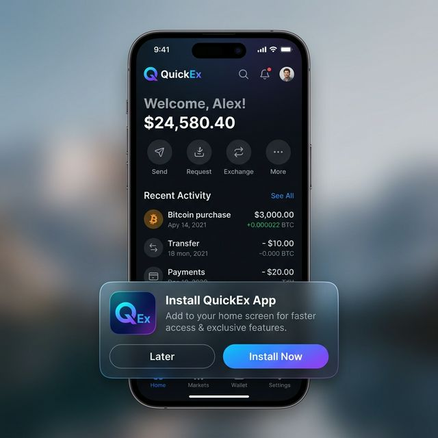
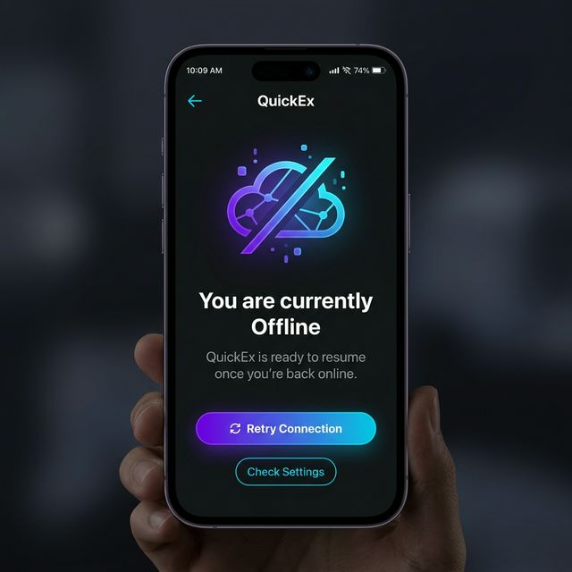

# PWA Installation & Offline Behavior

This document describes the Progressive Web App (PWA) capabilities of the QuickEx frontend: how the install prompt works, how the web app manifest is configured, how offline fallback operates, and how developers can test both flows.

All runtime logic lives under `app/frontend/` — specifically the manifest at [`manifest.ts`](file:///c:/Users/USER/Documents/GitHub/QiuckEx/app/frontend/src/app/manifest.ts), the service worker at [`sw.js`](file:///c:/Users/USER/Documents/GitHub/QiuckEx/app/frontend/public/sw.js), and the install/offline UI glue in [`PWAHandler.tsx`](file:///c:/Users/USER/Documents/GitHub/QiuckEx/app/frontend/src/components/PWAHandler.tsx) and [`offline/page.tsx`](file:///c:/Users/USER/Documents/GitHub/QiuckEx/app/frontend/src/app/offline/page.tsx).

For broader performance considerations that interact with caching, see [FRONTEND-PERFORMANCE.md](file:///c:/Users/USER/Documents/GitHub/QiuckEx/docs/FRONTEND-PERFORMANCE.md).

---

## 1. Install Prompt Flow

### 1.1 How `beforeinstallprompt` Works in Modern Browsers

The `beforeinstallprompt` event is a browser-initiated event that fires **only when the browser determines** the site meets the PWA installability criteria. The event is **not** directly triggered by application code — the browser controls when it fires, and applications can only intercept it to defer or customize the prompt.

Key behavioral properties:
- The event fires at most **once per page load** (in most Chromium-based browsers). If the user dismisses the browser-level mini-infobar, the event will not fire again until the browser's internal cooldown elapses (typically ~3 months, or until the user clears site data).
- Calling `event.preventDefault()` **suppresses the browser's default mini-infobar** and lets the application surface its own, branded install UI instead.
- The captured event object exposes two methods:
  - `prompt()` — programmatically shows the browser's native "Add to Home Screen" dialog. It returns a Promise that resolves once the user makes a choice.
  - `userChoice` — a Promise that resolves to `{ outcome: 'accepted' | 'dismissed' }`, indicating whether the user accepted or cancelled the native dialog.

### 1.2 Conditions Required for the Install Prompt to Appear

Browsers will only fire `beforeinstallprompt` when **all** of the following are true:

| # | Criterion | QuickEx Status |
|---|-----------|----------------|
| 1 | The site is served over **HTTPS** (or `http://localhost` for development) | Enforced via HSTS header in [`next.config.ts`](file:///c:/Users/USER/Documents/GitHub/QiuckEx/app/frontend/next.config.ts#L4-L13) |
| 2 | A valid **web app manifest** is present and linkable | Generated by [`manifest.ts`](file:///c:/Users/USER/Documents/GitHub/QiuckEx/app/frontend/src/app/manifest.ts) (auto-linked by Next.js App Router) |
| 3 | Manifest includes at least **192×192 and 512×512 icons** | Both declared (see [Section 2](#2-web-app-manifest-configuration)) |
| 4 | Manifest sets `start_url` or another navigation entry | `start_url: '/'` configured |
| 5 | Manifest sets a valid `display` value (`standalone`, `fullscreen`, `minimal-ui`, or `window-controls-overlay`) | `display: 'standalone'` |
| 6 | A **service worker** is registered with a `fetch` handler | [`sw.js`](file:///c:/Users/USER/Documents/GitHub/QiuckEx/app/frontend/public/sw.js) registered in [`PWAHandler.tsx`](file:///c:/Users/USER/Documents/GitHub/QiuckEx/app/frontend/src/components/PWAHandler.tsx#L15-L36) |
| 7 | The user has **not** already installed the app to their home screen | Detected via `matchMedia('(display-mode: standalone)')` |
| 8 | The user has engaged with the site for a sufficient duration (browser heuristic, ~30 seconds of active use across visits) | Determined client-side by Chromium / Safari |

> **Mobile Safari Note**: iOS Safari does **not** support `beforeinstallprompt`. On iOS, users must manually use the Share → Add to Home Screen action. QuickEx relies on the manifest and service worker alone for iOS installability.

### 1.3 How QuickEx Captures and Triggers the Install Prompt UI

The install flow is managed by the `PWAHandler` client component:

1. **Service Worker Registration** — On component mount, if `'serviceWorker' in navigator`, the handler registers `/sw.js` and attaches an `updatefound` listener to prompt for page reloads when a new service worker version becomes `installed`.

2. **Install State Detection** — `window.matchMedia('(display-mode: standalone)').matches` detects if the app is already running in standalone (installed) mode. If true, the banner never renders.

3. **Event Capture** — A `beforeinstallprompt` listener calls `e.preventDefault()` to suppress the browser's default mini-infobar, then stores the raw event object in component state (`installPrompt`) and flips `showBanner` to `true`.

4. **Banner Render** — When `showBanner === true && isInstalled === false`, the component renders a fixed-position, bottom-aligned banner card with a gradient icon, title ("Install QuickEx App"), description, and two buttons: **Install Now** and **Later**.

5. **User-Initiated Prompt** — Clicking **Install Now** invokes `installPrompt.prompt()`, which shows the **native browser install dialog**. The handler awaits `installPrompt.userChoice`; if `outcome === 'accepted'`, it hides the application banner. The browser's own `appinstalled` event also fires and independently clears banner + prompt state.

6. **Dismissal** — Clicking **Later** sets `showBanner = false` and hides the banner for the remainder of the page session (until reload).

### 1.4 Full User Flow: Visit → Eligibility → Prompt → Install

```
[1] User visits quickex.to in a Chromium-based browser (desktop or Android)
        │
        ▼
[2] PWAHandler mounts → registers /sw.js → SW activates on subsequent navigations
        │
        ▼
[3] Browser evaluates installability criteria (HTTPS + manifest + icons + SW + engagement)
        │
        ├─── CRITERIA NOT MET → no event fires → no UI shown
        │
        ▼  CRITERIA MET
[4] beforeinstallprompt fires → PWAHandler.preventDefault() + captures event + shows banner
        │
        ▼
[5] User sees custom QuickEx install banner (see screenshot below)
        │
        ├─── User clicks "Later"   → banner hidden (session-only)
        │
        ▼  User clicks "Install Now"
[6] installPrompt.prompt() → native OS-level dialog opens (e.g. "Install QuickEx app?")
        │
        ├─── User clicks Cancel → outcome === 'dismissed', banner stays hidden for this session
        │
        ▼  User clicks Install
[7] App installs → browser fires appinstalled event → PWAHandler sets isInstalled=true
        │
        ▼
[8] App launches in standalone display mode (no browser chrome)
```

### 1.5 Screenshot Reference: `install_prompt.png`



**What this image represents (Step 5 of the flow above):**

This screenshot shows the **custom QuickEx install banner** rendered by `PWAHandler` after the `beforeinstallprompt` event was captured and the default browser mini-infobar was suppressed. Key elements in the screenshot:

- **Positioning**: `fixed bottom-6 left-6 right-6 md:right-8 md:w-96` — mobile full-width, desktop right-aligned card.
- **Visual identity**: Purple-to-cyan gradient icon tile matching the QuickEx brand, with a download-arrow glyph.
- **Call-to-action**: Two-button group — primary "Install Now" (triggers `installPrompt.prompt()`) and secondary "Later" (dismisses banner).
- **State meaning**: This UI is only visible when **all browser installability criteria are satisfied**, the `beforeinstallprompt` event has fired, the user has **not** yet installed the app, and the user has not dismissed the banner in this page session. When the user clicks **Install Now**, the browser's native install dialog (not pictured) will overlay this banner.

---

## 2. Web App Manifest Configuration

The QuickEx web app manifest is generated dynamically by Next.js's App Router manifest route at [`src/app/manifest.ts`](file:///c:/Users/USER/Documents/GitHub/QiuckEx/app/frontend/src/app/manifest.ts). It returns a `MetadataRoute.Manifest` object that Next.js serializes to JSON and serves at the well-known `/manifest.webmanifest` URL, automatically injecting a `<link rel="manifest">` into the document `<head>`.

### 2.1 Current Manifest Values

```
Field               Value                                       Notes
───────────────────────────────────────────────────────────────────────────────────────────
name                "QuickEx"                                   Full app name in launcher
short_name          "QuickEx"                                   Label under home-screen icon
description         "Privacy-focused payments on Stellar"       Store / installer description
start_url           "/"                                         Loaded when app opens from icon
display             "standalone"                                Opens without browser chrome
background_color    "#0a0a0a"                                   Splash-screen background
theme_color         "#0a0a0a"                                   Status bar / title-bar tint
icons (maskable)    /icon.png  512x512  purpose=maskable        Adaptive icon (rounded / shaped)
icons (any)         /icon.png  192x192  purpose=any             Standard home-screen icon
shortcuts[0]        Generate Link → /generator                  OS long-press context shortcut
shortcuts[1]        Dashboard     → /dashboard                  OS long-press context shortcut
```

### 2.2 Icons Configuration and Purpose

Two icon declarations share a single source file `/public/icon.png`:

| Declaration | Size | Purpose | Role |
|-------------|------|---------|------|
| 1 | 512×512 | `maskable` | Used by Android 13+ adaptive icons and newer launchers that clip icons to a mask (circle, rounded square, squircle, etc.). Safe-zone content must sit within the inner 80% of the 512 canvas, otherwise edges may be cropped by OEM masks. |
| 2 | 192×192 | `any` | Used by older Android launchers, Chrome desktop install, and as the minimum installability-required icon. Falls back for any display context that doesn't understand `maskable`. |

**Why both?** The browser's installability checklist specifically requires at least a 192×192 icon (`purpose: any` or `maskable any`) *and* a 512×512 icon. Without both, `beforeinstallprompt` never fires.

### 2.3 `theme_color` and `background_color` Usage

- **`background_color: "#0a0a0a"`** — The color shown by the OS **before the first paint** of the installed app (the splash screen backdrop). Because QuickEx uses a dark theme, setting this to the app's near-black background prevents a jarring white flash during the installed-app cold start. It is also the color painted behind the splash-screen icon image.

- **`theme_color: "#0a0a0a"`** — Tints the browser chrome *during regular browsing* and the system status bar / title bar *in installed standalone mode*. On Android, this colors the top status bar to match the app, eliminating the default bright-white header. On desktop installed PWAs (Chrome/Edge), this colors the window title bar.

### 2.4 `start_url` Behavior

`start_url: '/'` ensures that tapping the installed home-screen icon always navigates to the application root, regardless of what deep URL the user was viewing when they installed. The browser appends the manifest's `id` (when set) or the `start_url` origin to identify distinct PWA installs. In QuickEx's configuration, the site root is also the canonical entry point for authentication redirects and org switcher flows.

**Practical implications**:
- Users who install from `/generator` or a payment-link URL still get dropped at `/` on subsequent cold launches.
- Shared payment links work independently; they are ordinary web URLs that happen to be openable *inside* the installed PWA once the user is already authenticated.

### 2.5 Display Modes

QuickEx uses `display: 'standalone'`. This section contrasts the four standard modes so changes can be evaluated against UX intent:

| Display Mode | Browser Chrome | Typical UX | When to Consider for QuickEx |
|--------------|---------------|------------|-------------------------------|
| `standalone` | **None** — app runs in its own window / activity with system-level window controls | Feels like a native app. Back navigation is OS-managed (Android back-gesture, desktop window title bar). | **Current choice.** Preferred for a payments product that should feel native and not leak browser-affordance confusion (e.g. users reloading mid-flow). |
| `fullscreen` | No chrome **and** no status bar. Takes the entire physical screen. | Immersive, game-like. Status bar must be drawn by the app itself. | **Avoid.** Payments require visible system-level status indicators (clock, network, battery) to reassure users during signing. |
| `minimal-ui` | A minimal set of browser controls (back/forward/reload) plus status bar. | A middle ground: feels app-like but escape hatches remain if users get stuck on pages without in-app back buttons. | Consider if onboarding flows ever trap users who lack in-app navigation. |
| `browser` | Full browser address bar and tabs. | Standard web. | **Mutually exclusive with installability.** Will prevent the prompt from appearing. |

### 2.6 How Each Field Affects Installation and UX

| Manifest Field | Directly required for install? | UX impact if changed / omitted |
|----------------|--------------------------------|--------------------------------|
| `name` / `short_name` | Yes (one of each required) | Name appears under the icon, in install dialogs, window title, and OS task switcher. Truncation kicks in under ~12 chars for `short_name` on dense launcher grids. |
| `icons` (192 + 512) | **Yes — hard requirement** | Omitting either drops PWA installability entirely. Wrong `purpose` value can cause icon clipping or fallback to generic globe icons on some launchers. |
| `start_url` | Effectively yes (default = current URL) | Wrong value can send users to an unauthenticated landing page or break scope. Must stay within the PWA navigation scope implicitly defined by the manifest URL. |
| `display` | Yes (must be one of the three valid non-browser modes) | `standalone` enables windowed/native launch. Changing to `browser` silently disables installability and reverts to in-tab navigation. |
| `background_color` | No | Splash flash mismatch. Users perceive this as "slow load" or "broken styling" during cold start. |
| `theme_color` | No | Inconsistent status bar color on Android, white title bar on desktop installed PWAs. Also causes Lighthouse "Does not set a theme color" audit failure. |
| `shortcuts` | No | Omitting removes long-press quick actions from launcher icons. Each shortcut is a deeplink that cold-starts the app at the given URL. |

### 2.7 Safe Modification Guidelines and Risks

**Safe changes** (low risk, testable in preview deployments):
- Updating `description`, `name`, `short_name` text strings.
- Adding new `shortcuts` entries (as long as URLs stay within app scope and map to real routes).
- Replacing `/icon.png` with a new image that **still matches both 192 and 512** (or updating both icon entries to point at two separate, correctly-sized files).

**Requires full PWA installability retest**:
- Any change to `icons` array (sizes, `purpose` fields, or new files introduced) — always re-check `beforeinstallprompt` fires.
- Any change to `display` — immediately affects installability and installed-app windowing.
- Any change to `start_url` — test install → close → reopen flow from a fresh home-screen tap.

**High-risk / avoid**:
- Removing either the 192 or 512 icon declaration.
- Setting `display: 'browser'`.
- Changing `start_url` to a path that requires authentication (unauthenticated users who tap the icon will see a login loop or 404/401 flash unless the route redirects them).
- Using a `purpose: maskable` icon without verifying the safe-zone artwork (inner 80%) is still recognizable. Oversized or edge-placed logos get clipped by OEM launcher masks.

---

## 3. Offline Fallback Behavior

### 3.1 High-Level Service Worker Role

QuickEx ships a simple cache-then-network service worker (`/public/sw.js`, scoped to `/` by default as a service worker served from the site root). The service worker is the **only** mechanism that enables offline behavior — without an active controlling SW, the browser's default "No internet" error page is shown instead.

Three lifecycle events power the behavior:

- **`install`** — Opens the `quickex-v1` cache and writes the asset whitelist (`/`, `/offline`, `/icon.png`, `/favicon.ico`) using `cache.addAll`. Calls `self.skipWaiting()` so a newly deployed SW activates immediately for any already-open tabs, rather than waiting for them to close.
- **`activate`** — Deletes any cache whose name does **not** match `CACHE_NAME` (cache versioning / cleanup on deploy). Calls `self.clients.claim()` so the newly-activated SW begins intercepting fetches for the current page session immediately.
- **`fetch`** — Intercepts every same-origin GET request and forks behavior based on request mode (see §3.2).

> No deep service-worker implementation details are documented here by design — the fetch strategy is deliberately minimal and should be changed with care. See [SW.js code](file:///c:/Users/USER/Documents/GitHub/QiuckEx/app/frontend/public/sw.js) for the full 49-line implementation.

### 3.2 How Offline Mode Works

The `fetch` handler implements a **split strategy**:

**A. Navigation requests** (`event.request.mode === 'navigate'`)

Navigation requests are HTML-document loads triggered by clicking links, typing URLs, form submissions that change the document, or initial page loads. The strategy is **network-first**:

1. Try `fetch(event.request)` over the network.
2. If fetch **rejects** (DNS failure, offline, TLS failure, CORS preflight offline → rejected Promise), fall back to `caches.match(OFFLINE_URL)` which resolves to the cached `/offline` HTML route.
3. If the offline page is itself not in cache, the browser falls through to its native offline error.

This means **only navigations get offline fallback** — the user can continue browsing between cached routes while offline, and anything that requires a fresh HTML load that the network can't serve gets replaced with the branded offline page.

**B. Subresource requests** (static assets, images, fonts, JS chunks, API GETs)

Non-navigation GETs use a **cache-first** strategy:

1. Check `caches.match(event.request)`.
2. Return the cached response if present.
3. Otherwise fetch from the network; network responses are **not** auto-added to cache.

This conservative approach avoids growing the cache with unbounded API-response data or random third-party assets. Only the install-time whitelist (`ASSETS_TO_CACHE`) is cached.

### 3.3 What Triggers the Offline Fallback UI

The offline page (`/offline`) is rendered to the user when **all** of the following are simultaneously true:

1. A service worker with `CACHE_NAME = 'quickex-v1'` is **activated and controlling** the current page (check DevTools → Application → Service Workers → "is activated and is running").
2. The user performs a **navigation** (HTML document load) — either by typing a URL, clicking an internal link, or pressing reload.
3. That navigation `fetch` **fails to resolve** (network unavailable, DNS down, no route to host, etc.) — a 500/404 HTTP status from the server does **not** trigger offline fallback; only a rejected Promise does.
4. The `/offline` route was successfully added to the cache during the most recent SW `install` event (i.e., the site was reachable once before going offline).

### 3.4 What Users See When the Network Is Unavailable

The offline page is implemented at [`src/app/offline/page.tsx`](file:///c:/Users/USER/Documents/GitHub/QiuckEx/app/frontend/src/app/offline/page.tsx). It presents a centered, full-height layout with:

- **Icon**: A large "building / offline" glyph in a rounded card container, communicating visually without relying on color alone.
- **Headline**: "You're Offline" with the purple-to-cyan gradient text treatment consistent with the rest of QuickEx's branded typography.
- **Body copy**: A reassuring one-liner explaining the connection was lost and that QuickEx will resume when back online.
- **Primary action**: "Retry Connection" button that performs a full `window.location.reload()` so the service worker reattempts the navigation fetch.
- **Progressive tip**: A secondary contextual card stating that previously cached basic features are still available if they were visited before going offline.

Crucially, the user **does not** see the browser's default dinosaur / "No internet" error — they stay within the QuickEx brand shell.

### 3.5 Screenshot Reference: `offline_fallback.png`



**What this image represents (Section 3.3 + 3.4):**

This screenshot depicts the **branded offline fallback page** rendered by the service worker after a navigation `fetch` rejected while offline. Specifically:

- The browser had **already installed and activated** `quickex-v1` service worker during a prior online session.
- The user performed a navigation (e.g., clicked a link or hit reload) while the device had no network.
- The service worker's network-first strategy for navigations caught the rejected fetch.
- The `/offline` route had been previously cached via `cache.addAll` in the SW install event, so `caches.match(OFFLINE_URL)` resolved successfully and served this HTML.
- The page shown is **not** a browser error page — it is QuickEx's own React server component rendered as static HTML, cached at `/offline`, then re-served by the SW. The page can therefore call `window.location.reload()` to retry connectivity when network returns.

### 3.6 Cross-Reference: Performance Documentation

Offline behavior and caching interact directly with frontend performance metrics (LCP, FCP, TTFB) and asset freshness guarantees. For the broader performance strategy, cache policy rationale, and metric budgets, refer to:

→ [FRONTEND-PERFORMANCE.md](file:///c:/Users/USER/Documents/GitHub/QiuckEx/docs/FRONTEND-PERFORMANCE.md)

Key overlaps to read together with this document:
- **Service-worker update cycles** — how `skipWaiting` / `clients.claim` interact with Lighthouse's SW-registration audit.
- **Cache invalidation** — the `CACHE_NAME` version bump convention and its effect on repeat-visit LCP.
- **Asset whitelist** — which static assets are / are not pre-cached and how that maps to critical-request-chains budgets.

---

## 4. Testing Guide

### 4.1 Install Prompt Testing

#### 4.1.1 Chrome Desktop Steps

1. **Prerequisites**: Use a Chrome / Edge / Chromium profile that has **not** already installed QuickEx to its OS. If installed, uninstall it first (chrome://apps → right-click → Remove from Chrome).

2. **Serve over HTTPS or localhost**:
   - Local dev: `cd app/frontend && npm run dev` and open `http://localhost:3000` (localhost is exempt from the HTTPS installability requirement).
   - Preview / staging: open the deployment URL and confirm the padlock is valid and no mixed-content warnings appear.

3. **Clear prior dismissal state** (critical if you've previously clicked "Later" or cancelled the native install dialog):
   - DevTools → Application → Storage → click **Clear site data** (check all boxes including "Service workers" and "Cache storage").
   - Close all tabs to the origin. Chromium's heuristic "engagement score" persists per-profile; a fresh incognito window (Ctrl+Shift+N) is the fastest way to get a clean slate **without service worker persistence across sessions** — but note incognito blocks `beforeinstallprompt` in some builds, so regular profile + site-data clear is more reliable.

4. **Verify installability in DevTools**:
   - Open DevTools → **Application → Manifest**. Confirm:
     - Status reads "All checks passed" / green.
     - Icons panel shows both 192 and 512 entries loaded.
     - `display` is `standalone`, `start_url` resolves.
   - Navigate to **Lighthouse → Categories → Progressive Web App** and run an audit. The "Installable" row should be a green check.

5. **Trigger engagement (if needed)**:
   - If DevTools shows the manifest as valid but no banner appears, navigate to a few pages, click around, and keep the tab open ~30+ seconds to build Chromium's site-engagement heuristic score.
   - You can force-dispatch a synthetic `beforeinstallprompt` event from the DevTools console to **bypass engagement checks during development only**:
     ```js
     // Dev-only. NOT reliable for production verification.
     window.dispatchEvent(new Event('beforeinstallprompt'));
     ```
     Note: synthetic events have no real `.prompt()` method — the QuickEx banner will render, but clicking "Install Now" will log a rejected Promise. Use this only to verify banner visual rendering, not end-to-end install.

6. **Confirm correct installation behavior**:
   - When the QuickEx banner appears, click **Install Now**. The native Chrome install dialog (title bar: "Install QuickEx app?") opens.
   - Click **Install** in the native dialog. Expected outcomes:
     - `appinstalled` fires in browser → QuickEx banner disappears.
     - A new standalone window opens (no address bar). Window title is "QuickEx".
     - Window → Inspect → Console (the standalone window's own DevTools) shows `matchMedia('(display-mode: standalone)').matches === true`.
     - chrome://apps (desktop) or Start Menu search now lists "QuickEx" with the 512-pixel icon.
   - Uninstall via chrome://apps or the installed window's App info menu, then re-run step 3 to retest.

#### 4.1.2 Mobile Browser Steps

**Android Chrome / Edge**:
1. Uninstall any prior QuickEx PWA from the Android home screen and app drawer (Settings → Apps → QuickEx → Uninstall).
2. Clear Chrome site data for the QuickEx origin (Chrome → Settings → Privacy and security → Site data → search origin → Delete).
3. Open the site in Chrome Android. Browse around for ~30 seconds.
4. Two independent cues that installability is active:
   - Chromium may briefly show its **mini-infobar** at the bottom (default) — QuickEx suppresses this; if you see it, PWAHandler's `preventDefault()` did not run (check that PWAHandler is mounted before the event fired).
   - Chrome's **3-dot menu** shows "Install QuickEx…" as a menu item (Chrome always adds this regardless of banner suppression).
5. Expect the custom QuickEx bottom banner to appear after criteria met. Tap **Install Now** → accept the native dialog → confirm a new app icon appears on home screen, and launching it opens without address bar.

**iOS Safari**:
1. iOS 16.4+ supports more of the PWA spec but **not** `beforeinstallprompt`. No custom banner will ever show on iOS.
2. Verify installability manually:
   - Tap **Share** (square with up arrow) → **Add to Home Screen**.
   - The Add dialog should show the 192-pixel QuickEx icon, name "QuickEx", and the URL. Tap Add.
   - Return to home screen, tap the icon. It should launch with no Safari chrome (standalone) and `theme_color` should tint the status bar dark.
   - Going fully offline, closing the installed app, and reopening should serve `/offline` (cached) instead of Safari's offline page — this is the key test to confirm SW + offline works on iOS 16.4+.

#### 4.1.3 Conditions Required for Prompt to Appear (Testing Checklist)

For each browser you test, tick off and confirm each:

- [ ] HTTPS (or localhost) and valid cert (no mixed content).
- [ ] `/manifest.webmanifest` loads over network with HTTP 200 + correct `Content-Type: application/manifest+json`.
- [ ] Both 192×192 (any) and 512×512 (maskable) icons resolve.
- [ ] Service worker `/sw.js` registers successfully (`navigator.serviceWorker.controller !== null` after second load).
- [ ] SW fetch handler is present and registered (check DevTools → Application → Service Workers → Fetch handler).
- [ ] App is **not** already installed (`matchMedia('(display-mode: standalone)').matches === false`).
- [ ] Site engagement score is sufficient (or use DevTools `beforeinstallprompt` dispatch for visual regression tests).
- [ ] `beforeinstallprompt` event fired — add a temporary `console.log('BIP!', event)` in PWAHandler's handler to confirm.

#### 4.1.4 How to Verify Correct Installation Behavior

After clicking **Install**:

1. Banner disappears (both `outcome === 'accepted'` handler and `appinstalled` fire).
2. `display-mode: standalone` matchMedia returns `true` in the newly opened installed app's Console.
3. Opening the OS app list / home screen shows QuickEx with the correct icon.
4. Launching from the icon navigates to `start_url` (`/`), not the last-visited page.
5. Status bar on Android / title bar on desktop matches `theme_color`.
6. Splash screen on cold start flashes `background_color` before first paint.

### 4.2 Offline Testing

#### 4.2.1 How to Simulate Offline Mode Using DevTools

Chrome / Edge (most reliable, works for desktop and mobile Chrome USB-debugged):

1. Open the target site, ensure you've loaded at least one full page **online** so the SW installs and caches its whitelist.
2. DevTools → **Application → Service Workers**:
   - Confirm the SW row shows "Status: activated and is running" (green dot).
   - Check the **Offline** box in the Service Workers panel. This forces only fetches intercepted by this SW's scope to fail (not the entire browser, so DevTools itself still works).
3. Alternative (whole-tab offline): DevTools → **Network → Throttling dropdown → Offline**. This simulates no network at the tab level — any request (including non-sw ones) fails. Use this when you want to reproduce real airplane-mode conditions.
4. Third option (OS-level): On physical mobile, enable Airplane Mode. On desktop, unplug Ethernet / disable Wi-Fi.

Firefox:
- DevTools → **Network → Work Offline** checkbox (older Firefox builds) or use Network → Throttling → Offline.

#### 4.2.2 Expected Fallback UI Behavior

Run through this matrix once per offline trigger:

| Action (while offline) | Expected result | Pass / Fail |
|------------------------|-----------------|-------------|
| Press **F5 / reload** on any page | Branded `/offline` page loads (not browser error) | |
| Click an internal link (e.g. Dashboard nav) | `/offline` page loads | |
| Directly type a deep URL (e.g. `/generator`) and press Enter | `/offline` page loads | |
| On the `/offline` page, click **Retry Connection** while still offline | Spins then returns to `/offline` (expected — still offline) | |
| Restore network, then click **Retry Connection** | Full app reloads; original (pre-offline) route navigates successfully and authenticated session is intact | |
| Static `/icon.png` `` reference after prior cached visit | Should load from cache (cache-first subresource strategy) — verify image loads while offline | |

#### 4.2.3 How to Confirm Caching / Service Worker Is Active

Use DevTools → Application to inspect state end-to-end:

1. **Service Worker status**:
   - Application → Service Workers. Look for `/sw.js` row:
     - Green "running" indicator.
     - "Clients" count ≥ 1 for the tab.
     - "Update on reload" checkbox: *uncheck* for real offline testing; leaving it on forces SW reinstall every reload which can mask cache-miss bugs.

2. **Cache Storage contents**:
   - Application → Cache Storage → `quickex-v1`.
   - Entries present: `/`, `/offline`, `/icon.png`, `/favicon.ico`. Anything outside this list means a prior SW version or manual cache write is present — manually delete any unexpected caches to avoid false-positive offline hits.

3. **Fetch interception (live)**:
   - With offline checkbox enabled in Service Workers panel, navigate anywhere.
   - DevTools → Network → the failing HTML navigation's **Size** column should show `(from ServiceWorker)`, and **Waterfall** → click → Timing tab shows "ServiceWorker Preparation".
   - If the offline page itself shows `(from ServiceWorker)` as its size, the fallback chain worked end-to-end.

4. **Console sanity checks** (run in Console while offline):
   ```js
   // SW is controlling this page?
   await navigator.serviceWorker.ready;
   console.log('SW controller:', navigator.serviceWorker.controller?.scriptURL);
   // Expected: "/sw.js"

   // Offline cache entry exists?
   caches.open('quickex-v1').then(c => c.keys()).then(console.table);
   // Expected: 4 entries matching ASSETS_TO_CACHE
   ```

If any of these checks fail, the most common root cause is:
- The SW never achieved `activated + controlling` state before going offline. Fix: do an online navigation (or two) first; `self.clients.claim()` in the activate handler should cover it but stale tabs sometimes need one reload to be claimed.
- The `/offline` route failed during install (e.g., it returned a 5xx on first visit). Re-check the `cache.addAll` warning in Console; the SW intentionally `.catch()`es this and warns so install does not fail, but offline fallback then won't work.
- Cache name mismatch (changed `CACHE_NAME` but did not bump it consistently across test runs). Clear site data and retry.

---

*End of document. No application code changes were required for this documentation.*
